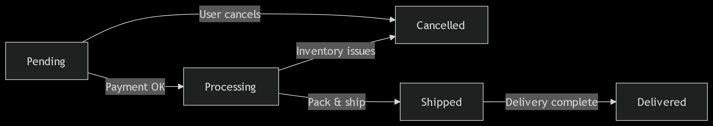
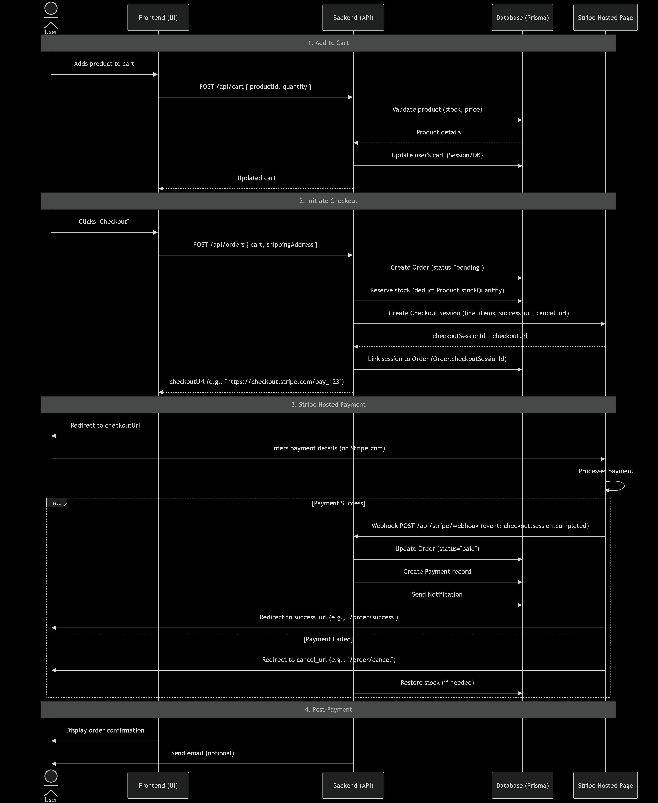

**[presentation](https://gamma.app/docs/Building-Cart-Order-Management-The-Digital-Shopping-Experience--y8lh853u4rei8b7)**

# Building Cart & Order Management: The Digital Shopping Experience 🛒

## Lesson Overview

Welcome to the shopping experience phase! In this lesson, we'll build the cart and order management system. Think of it as creating a digital shopping experience where customers can add items to their cart and complete orders 🛒.

## For Instructors

### Lesson Objectives

Students will learn:
- Implement cart management
- Create order system
- Handle checkout process
- Understand order states

### Teaching Strategy

- Use the "shopping cart" analogy
- Start with basic cart functionality
- Add order management
- Use sequence diagrams
- Explain state machines (diagram)
- don't implement payment in the checkout in this session
- payments are handled in the next session

## Part 1: Cart Management - The Digital Shopping Cart 🛒

### Key Features

1. **Cart Operations**
   ```javascript
   // POST /api/cart/items
   - Add items to cart
   - Update quantities
   - Remove items
   ```

2. **Cart Persistence**
   - Store cart in database
   - Handle sessions
   - Implement cleanup

## Part 2: Order Management - The Digital Checkout 🏷️

### Key Features

1. **Checkout Process**
   ```javascript
   // POST /api/orders
   - Validate cart
   - Create order
   - Handle stock
   ```

2. **Order States**
   ```javascript
   const orderStates = {
     PENDING: 'pending',
     PROCESSING: 'processing',
     COMPLETED: 'completed',
     CANCELLED: 'cancelled'
   };
   ```

## Part 3: State Machine - The Digital Workflow 🔄


### Key Concepts

1. **Order States**
   - Initial state: PENDING
   - Processing state
   - Completion state
   - Cancellation state

2. **State Transitions**
   - Validate transitions
   - Handle errors
   - Log changes

## Part 4: Sequence Diagram - The Digital Flowchart 📊


### Key Steps

1. **Order Process**
   ```mermaid
   sequenceDiagram
   participant Customer
   participant Cart
   participant Order
   participant Payment
   
   Customer->>Cart: Add items
   Cart->>Order: Create order
   Order->>Payment: Process payment
   Payment-->>Order: Confirm payment
   Order-->>Customer: Send confirmation
   ```

2. **Error Handling**
   - Handle stock issues
   - Handle payment failures
   - Handle cancellations

### Best Practices

- Always validate cart items
- Handle stock updates
- Implement proper error handling
- Log all state changes

## Real-World Application

- Create a group activity where students test the checkout process
- Practice implementing state transitions
- Test error scenarios

## Next Steps

In the next lesson, we'll dive into payment integration. Get ready to build the payment system! 💳
